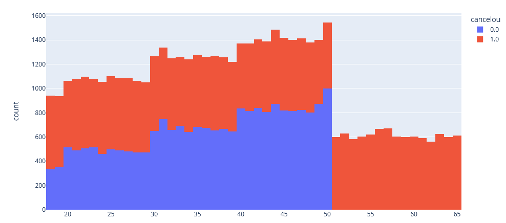

# analise-de-cancelamento-de-contrato

 Esse projeto é uma análise de cancelamento de contratos, os screenshots abaixo foi as causas do motivos de cancelamento.

 ## Cancelamento por tipo do contrato mensal

 

 ## Cancelamento por idade, clientes acima de 50 anos cancelam o contrato

 

 ## Cancelamento, indicador dias de atraso,clientes que atrasam mais de 20 dias o pagamento cancelam o contrato

 

 ## Cancelamento por ligações no call_center,clientes que ligam mais de 5 vezes no call_center cancelam o contrato

 
